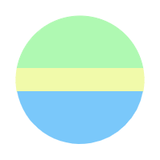

# EasyGIS

  

# [English](./README.md)
一个简单的前端gis小工具

# Description
基于 [Openlayers](https://openlayers.org), 可以帮你实现一些日常小需求.

**注意！！！默认底图用的OpenStreetMap，由于大陆国策局规定国内没有在线的免费84地图，可能需要科学上网才能访问**

# Features
- 矢量数据预览
- 坐标格式和坐标系转换
- 几何图形绘制
- OGC图层预览

# TODO
- 编辑几何体
- 绘制带空的面
- 拆分和合并面
- 添加gcj02和bd09坐标转换
